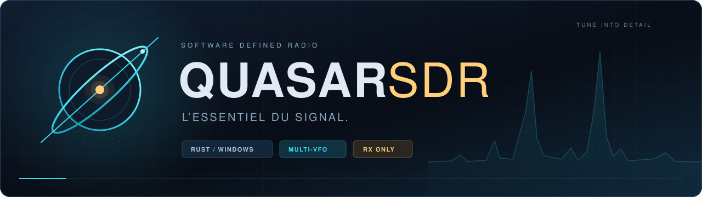
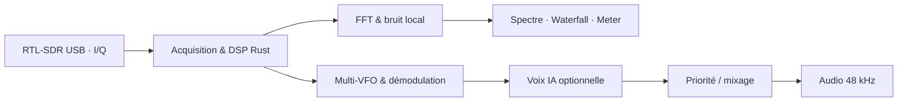

<p align="center">
  
</p>

<p align="center">
  <strong>Explorez la bande. Suivez les communications. Gardez l’essentiel.</strong><br>
  Un récepteur SDR multi-canaux en Rust, conçu pour Windows et l’écoute en temps réel.
</p>

<p align="center">
  <a href="#aperçu">Aperçu</a> &nbsp; / &nbsp;
  <a href="#une-bande-plusieurs-écoutes">Fonctionnalités</a> &nbsp; / &nbsp;
  <a href="#première-réception">Démarrage</a> &nbsp; / &nbsp;
  <a href="#sous-le-capot">Architecture</a>
</p>

---

## Aperçu


<p align="center"><sub>Capture réelle sous Windows · RTL-SDR Blog V4 · Deux canaux WFM en mixage · Bande instantanée de 2,40 MHz</sub></p>

## Une bande, plusieurs écoutes

QuasarSDR réunit l’exploration du spectre et l’écoute multi-canaux dans une interface
bleu nuit, cyan et ambre. Accordez une fréquence, placez vos VFOs dans la bande
reçue, puis choisissez l’écoute prioritaire ou le mixage.

| Explorer | Détecter | Écouter |
| :--- | :--- | :--- |
| **Spectre & waterfall** avec accord au clic | **Auto zéro** pour mesurer et suivre le fond local | **Jusqu’à 8 VFOs** dans la bande reçue |
| **Déplacement de bande** à la souris | **SQL relatif** au-dessus du bruit | **Auto-swap** selon les priorités, mute et solo |
| **Saisie directe** de la fréquence | **Masquages visuels** du fond et du pic DC | **Mixage** des canaux actifs |
| **Meter dBFS** animé avec maintien de crête | **CTCSS & VAD** expérimentaux | **Voix IA locale** avec RNNoise, activable à la demande |

**Modes de réception :** NFM · WFM mono · AM · LSB · USB.

> **100 % RX.** Aucune fonction d’émission RF. L’application utilise un SDR USB réel ; sans appareil compatible, les réglages restent désactivés. Aucun mode simulation dans l’interface.

## Première réception

### 1 · Préparer le matériel

- **Windows x64**, Rust stable et Visual Studio Build Tools avec C++ / SDK Windows.
- Un récepteur **RTL-SDR** ; le **RTL-SDR Blog V4** est testé sur le matériel de développement.
- Le pilote **WinUSB** et les bibliothèques x64 indiquées dans le [guide des drivers](drivers/README.md).

Les DLL ne sont pas incluses dans le dépôt. Placez-les dans `drivers/` avant de
lancer l’application. Le [guide officiel Blog V4](https://www.rtl-sdr.com/v4/)
détaille la préparation du récepteur.

### 2 · Compiler et lancer

```powershell
git clone https://github.com/odessadraekavik/QuasarSDR.git
cd QuasarSDR
cargo run --release --locked
```

Pour préparer le dossier exécutable avec ses DLL locales :

```powershell
.\build-windows.ps1
.\target\release\quasar-sdr.exe
```

### 3 · Choisir sa fréquence

Sélectionnez votre appareil dans **SOURCE USB**. La réception démarre sur le
**canal VHF marine 16 — 156,800 MHz**, avec un gain RF demandé de **+28 dB**
et un SQL relatif de **+10 dB**.

| Commande | Geste |
| :--- | :--- |
| Accorder un canal | Cliquer sa carte VFO, saisir les MHz dans le grand afficheur, puis **ACCORDER** ou Entrée |
| Explorer la bande | Cliquer le spectre pour accorder ; glisser pour déplacer la bande reçue |
| Refaire la référence de bruit | Appuyer sur **AUTO ZÉRO**, de préférence pendant une pause des communications |
| Atténuer le souffle audio | Activer **VOIX IA** et ajuster son intensité ; désactiver pour comparer |
| Choisir l’écoute | **AUTO-SWAP** pour la priorité, **MIX** pour plusieurs canaux |

Les toggles cyan sont actifs. Les détails de chaque VFO se trouvent dans
**Réglages du canal**.

## Sous le capot



**Interface** — egui / eframe &nbsp; · &nbsp; **DSP** — rustfft / num-complex<br>
**Audio** — CPAL &nbsp; · &nbsp; **Concurrence** — crossbeam &nbsp; · &nbsp; **Voix** — nnnoiseless / RNNoise

Le traitement s’exécute localement. La réduction de bruit vocale ne dépend d’aucun
service cloud et son modèle est embarqué.

<details>
<summary><strong>État du projet & prochaines étapes</strong></summary>

QuasarSDR est en développement actif. La cible actuelle est **Windows / RTL-SDR**.
Linux, macOS et une interface WASM ne sont pas encore pris en charge.

- Les VFOs simultanés partagent la **bande instantanée de 2,40 MHz** d’un seul tuner.
- Le meter affiche des **dBFS**, pas une puissance RF calibrée en dBm.
- Les options **DC** et **FOND** masquent l’affichage ; elles ne retirent pas le bruit des I/Q.
- RNNoise peut altérer les voix faibles ; CTCSS et VAD restent expérimentaux.
- WFM est mono, sans RDS. DCS, enregistrement audio et balayage automatique entre bandes restent à développer.

</details>

<details>
<summary><strong>Développer & vérifier</strong></summary>

```powershell
cargo fmt --all -- --check
cargo clippy --all-targets --locked -- -D warnings
cargo test --all-targets --locked
cargo build --release --locked
```

Le workflow [Windows RX](https://github.com/odessadraekavik/QuasarSDR/actions/workflows/windows.yml)
compile et vérifie le projet à chaque push. Ses exécutables nécessitent les DLL
locales décrites dans le guide des drivers.

L’ancienne documentation complète est conservée dans
[README technique — contexte de développement et IA](docs/README-technical.md) :
architecture détaillée, diagnostics matériels, paramètres DSP et limitations.

</details>

---

<p align="center">
  <strong>QUASAR SDR</strong><br>
  <sub>L’essentiel du signal. Toujours en réception.</sub>
</p>
